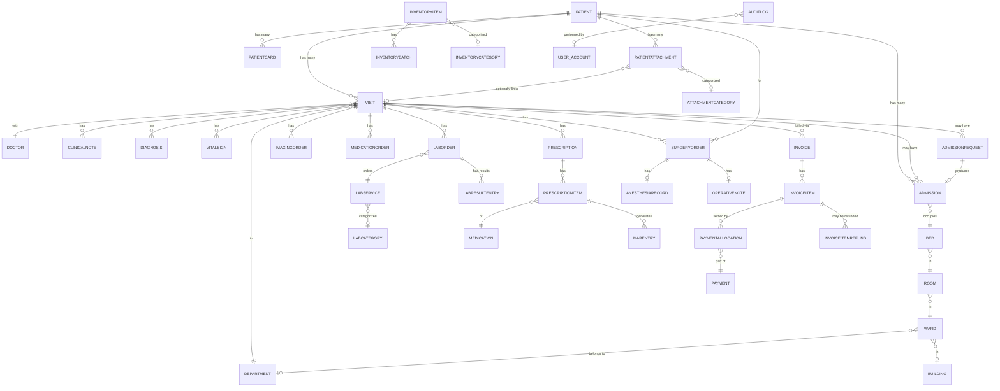

# Database Documentation

PostgreSQL, accessed exclusively through Django's ORM (`core/models.py`, ~6,700 lines). There
are no raw-SQL views, stored procedures, or triggers in this project — every constraint and
relationship is expressed in Django model code and enforced by ~50 migrations.

## Entity-Relationship Diagram (Core Spine)

The full schema has 100+ models — this diagram shows the "spine" every module hangs off:
`Patient` → `Visit` → clinical orders, plus the Facility/Admission and Billing backbones. Each
module documented in `docs/DEVELOPER_GUIDE.md` has its own smaller model cluster not repeated
here (e.g. the 8 Nursing assessment models, the Lab test-master tree, the Inventory item
master) to keep this diagram readable.



## Key Relationship & Design Conventions

These conventions are used consistently across nearly every model in the codebase — knowing
them explains 90% of the FK choices you'll see:

- **`on_delete=PROTECT`** is the default for anything financially or clinically significant
  (e.g. `Invoice.patient`, `Admission.bed`, `LabOrder.visit`) — you cannot delete a Patient,
  Bed, or Visit that still has dependent records; you must handle/reassign them first.
- **`on_delete=SET_NULL`** (always paired with `null=True, blank=True`) is used for optional
  contextual links that shouldn't block deletion of the other side — e.g.
  `PatientAttachment.visit`, `Admission.assigned_nurse`.
- **Soft delete, never hard delete**, for anything with legal/audit significance:
  `EmployeeSignature` (deactivate, keep history), `PatientAttachment` (`is_deleted` +
  `deleted_by`/`deleted_at`/`delete_reason`, Administrator-only, recoverable).
- **Versioning via self-referencing FK**, not an in-place overwrite: `PatientAttachment`
  (`previous_version` + `is_current`), `OperativeNote`/`PostOperativeNote` (similar chain
  pattern) — replacing a document creates a new row rather than mutating the old one.
- **Item-level, not just invoice-level, state**: `InvoiceItem` carries its own
  `payment_status` independent of the parent `Invoice`, so one line (e.g. a lab test) can be
  paid/cancelled/credit-approved without touching the rest of the bill.
- **Auto-generated business-document numbers** are computed in each model's `save()` override
  (e.g. `Invoice` → `INV-YYYYMM-####`) — see `docs/DEVELOPER_GUIDE.md` for the full list and
  pattern to follow when adding a new numbered document type.

## Constraints

Beyond standard FK/`NOT NULL` constraints, notable explicit constraints in the schema:

- `DepartmentStock` — a `UniqueConstraint` (with a `Q` condition) enforcing that exactly one of
  `medication` / `inventory_item` is set per row, never both or neither.
- `InventoryBatch` — `unique_together = ('inventory_item', 'batch_number')`.
- `Appointment`/`Payment`/etc. — unique auto-generated number fields (`unique=True`) rather than
  a composite natural key.
- Several `Meta.unique_together`/`UniqueConstraint` pairs exist per-domain (e.g. one active
  `CardSettings`/`ServiceChargeSettings` singleton row, enforced by always using `pk=1` rather
  than a DB-level constraint).

## Indexes

Explicit indexes exist where a query pattern is genuinely hot — most models rely on Django's
automatic FK indexes alone. Notable explicit ones:

| Model | Index | Why |
|---|---|---|
| `Patient` | `(last_name, first_name)`, `(card_number)` | Name/MRN search |
| `Visit` (via related models) | `(patient, -created_at)`, `(status, -created_at)` | Patient history timeline, status dashboards |
| `Appointment` | `(appointment_date, doctor)`, `(patient, appointment_date)`, `(status, appointment_date)` | Scheduling/availability queries |
| `AuditLog` | `module`/`action`/`severity`/`timestamp` all `db_index=True`, plus composite `(module, timestamp)`, `(user, timestamp)`, `(action, module)`, `(severity, timestamp)` | Every audit report filters on some combination of these |
| `EmployeeSignature` | `(employee, is_active)` | "Get the current active signature" is the hot path on every printed document |
| `PatientAttachment` | `(patient, is_current, is_deleted)`, `(category,)` | Every listing/report query filters on these together |
| `OR/Surgery scheduling` | `(date, operating_room)`, `(date, primary_surgeon)`, `(status,)` | Conflict checking on schedule |

## Migration Strategy

- **Additive-only history to date** — every migration in this project (~50 so far) has added
  fields/models with safe defaults rather than destructively altering or removing existing
  columns. Follow this convention: when a field genuinely needs to change type
  (e.g. CharField → ForeignKey, as happened once for a Lab Catalog category field), split it
  into `RemoveField` + `AddField` + a `RunPython` backfill step inside the same migration,
  rather than a single risky `AlterField` — inspect the auto-generated migration by hand before
  running it whenever Django's migration diff looks non-trivial.
- **Data-seeding migrations**: a few migrations include a `RunPython` step to seed reference
  data alongside the schema change (e.g. the 27 Attachment Categories are seeded in the same
  migration that creates the `AttachmentCategory` model) — this pattern is preferred over a
  separate manual seeding step when the data is small, fixed, and required for the feature to
  be usable immediately after `migrate`.
- Standard workflow for any model change:
  ```bash
  python manage.py makemigrations core --name descriptive_name
  # inspect the generated file — especially any AlterField / RemoveField
  python manage.py migrate
  python manage.py check
  python manage.py setup_rbac   # only needed if you added/changed permissions
  ```

## Backup & Restore Strategy

There is no in-application backup/restore feature — see `docs/BACKUP_RECOVERY.md` for the full
`pg_dump`/`pg_restore` procedure this project relies on operationally.
